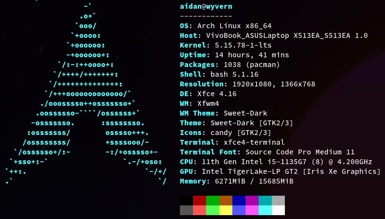

# Dotfiles

This repo houses the config files and scripts I use on my daily driver Linux laptop.

## What's Inside

This repo is structured like a full file system rather than a traditional dotfiles repo which would just represent a single `$HOME` folder setup. This is because I tend to use multiple Unix accounts on the command line, sometimes for security, sometimes to set up a different development environment, and sometimes just to prevent certain software from polluting my `$HOME` directory.

- #### [`/home/admin/`](home/admin/)

  This is the main directory with my dotfiles for things like:  
  `bash`, `git`, `gpg`, `xorg`.

  It also houses [`scripts/`](home/admin/scripts/).

- #### [`/home/dev/`]()

  This contains `$HOME` directories for Unix accounts made for specific programming languages and belonging to the `dev` user group, e.g. `dev-node` and `dev-ruby`. Using these for development helps to keep my system safe when running code from third party dependencies.

  I tend to keep my projects within this directory and either symlink them in my own `$HOME` directory, or make workspaces in VS Code.

## My Machine

Expect this repo to get pretty busy as I start to tinker with tiling window managers and ricing!
